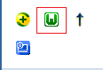
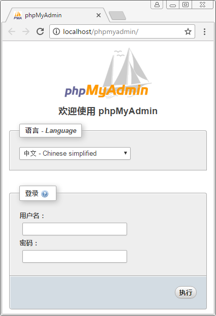
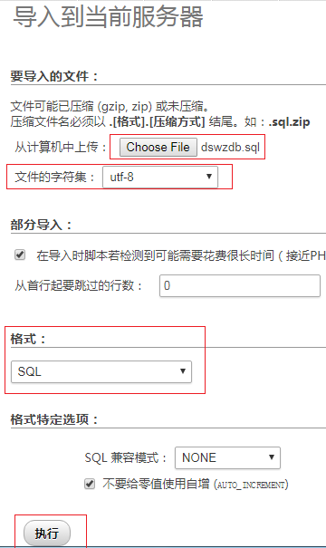
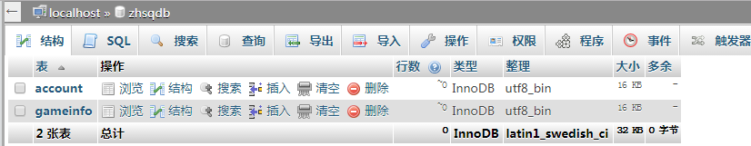
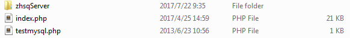

# 数钱游戏
> countMoney是一个简单的HTML5版数钱游戏，整个游戏由首页、注册页、数钱页、转转盘页、游戏结果展示页、我的账户页、排行榜页、活动商户页、活动规则页组成，整个游戏包含注册、数钱、转转盘、查看用户获得的优惠券、查看排行榜等功能。

## 在线访问
[http://meishadevs.com/CountMoney/#/](http://meishadevs.com/CountMoney/#/)  
**注意:** 有些功能需要自己配置服务器端才能访问，配置方式在此文档下面做了相关的介绍

## 用到的技术
- **前端：** vue + vuex + vue-router + axios + ESLint + ES6
- **构建工具：** Webpack
- **后台：** PHP
- **数据库：** MySQL

## 运行项目
	# 将项目克隆到本地
	git clone https://github.com/meishadevs/CountMoney.git
	
	# 进入zhsqClient目录下
	cd zhsqClient
	
	# 安装依赖
	npm install
	
	# 运行项目
	npm run dev
	
	# 编译并压缩代码用于发布，将编译后生成的dist文件夹放在服务器下即可访问
	npm run build
	
## 项目简介
**项目描述：** 整个项目的文件由zhsqClient、zhsqServer、sql三个文件夹组成，其中zhsqClient存放网站的前端代码、zhsqServer中存放的是网站的服务器端代码，sql中存放的是网站的数据库文件

**zhsqClient的目录结构**

	├── build                        // 项目构建相关的代码   
	├── config                       // 项目开发环境相关配置                  
	├── src       			 // 源码目录                                       
	│   ├── assets                   // 项目的资源目录      
	│   ├── css                      // 网站的CSS样式
	│   │   └── reset.css            // 重置标签的CSS样式
	│   ├── js                       // 一些常用的js脚本                           
	│   │   └── config.js            // 网站与服务器交互的URL                  
	│   ├── pages                    // 网站的页面
	│   │   ├── account.vue          // 我的账户页 
	│   │   ├── countMoney.vue       // 数钱游戏页
	│   │   ├── index.vue            // 网站首页     
	│   │   ├── merchant.vue         // 活动商户页
	│   │   ├── ranking.vue          // 排行榜页
	│   │   ├── register.vue         // 注册页 
	│   │   ├── result.vue           // 结果展示页
	│   │   ├── rule.vue             // 活动规则页
	│   │ 	└── turnTable.js         // 转转盘页    
	│   ├── router                   // 存放用来设置路由
	│   │ 	└── index.js             // 项目的路由
	│   ├── store                    // vuex状态管理器
	│   │   ├── action.js            // 加载各种action模块
	│   │   ├── index.vue            // 记录网站的状态
	│   │ 	└── mutations.js         // 加载各种mutations模块
	│   ├── App.vue                  // 页面入口文件
	│   └── index.js                 // 程序入口文件
	├── static                       // 存放一些静态文件
	│   	├── images		 // 网站的图片
	│   	├── .gitkeep		 // 只是一个占位符，一个假文件
	│ 	└── favicon.png    	 // 网站的图标
	├── .babelrc                     // babel编译的些配置
	├── .editorconfig                // 编辑器的配置
	├── .eslintignore                // 设置忽略做语法检查的文件
	├── .eslintrc.js                 // 设置ESLint语法检查的规则
	├── .gitignore                   // 提交到git上时，忽略提交的文件和文件夹
	├── .postcssrc.js                // 自动加载配置为PostCSS
	├── index.html                   // 入口HTML文件
	└── package.json                 // 项目配置文件

## 配置网站的服务器
> 整个网站的服务器使用的是PHP，数据库使用的是MySQL，服务器端我使用的是一个叫WampServer的软件，因为WampServer中同时集成了PHP和MySQL，下面的介绍的操作步骤也是使用WampServer

**第一步：安装WampServer**  
首先从网上下载一个WampServer软件，然后根据平时安装软件的方式直接点下一步下一步安装，安装过程中根据要求输入相应的信息，当启动WampServer出现下图所示的绿色图标表示WampServer安装成功，并且运行成功  

**第二步：启动phpMyAdmin**  
WampServer中使用phpMyAdmin管理MySQL数据库，单击上一步操作中出现的绿色的图标，在弹出的列表项中选择phpMyAdmin,点击phpMyAdmin后会使用默认浏览器打开如下图所示的phpMyAdmin登录界面  

**第三步：进入phpMyAdmin**
在用户名一栏中输入默认的用户名root，然后点击执行就可进入phpMyAdmin

**第四步：将网站需要用到的数据导入数据库中**  
选择导入，然后会弹出下图所示的界面，单击界面上的Choose File按钮，选择导入的文件为sql文件夹下的zhsqdb.sql，将文件字符集设置为utf-8，格式选为SQL，设置完成后点击执行  

**第五步：执行后的效果**  
此时可以看到，在MySQL数据库中创建了一个mydb数据库，mydb数据库下又创建了几张表

**第六步：部署服务器端代码**  
关闭phpMyAdmin，回到第一步的操作，再次点击绿色的小图标，在弹出的列表项中选择www directory，将zhsqServer文件夹拷贝到打开的目录下，此时中行数钱的服务器端代码就部署完成了，可以正常的使用网站中的注册、查看排行榜、查看我的优惠券等功能  

## 特别说明
当你的服务器地址和我设置的服务器端地址不同时，可以修改**countMoney\zhsqClient\src\js**下的config.js文件

	/**
	 * 一些全局参数
	 */

	export default {
	  install(Vue, option) {

	      //服务器端的Url
	      Vue.prototype.serverUrl = 'http://localhost/',

	      //注册信用卡账号的Url
	      Vue.prototype.registerUrl = Vue.prototype.serverUrl + 'zhsqServer/register.php',

	    //获得用户在数钱游戏中的排名的Url
	    Vue.prototype.rankingUrl = Vue.prototype.serverUrl + 'zhsqServer/ranking.php',

	    //将用户在游戏中获得的金额发送到服务器的Url
	    Vue.prototype.sendMoneyUrl = Vue.prototype.serverUrl + 'zhsqServer/sendResult.php',

	    //获得优惠券的Url
	    Vue.prototype.getCardUrl = Vue.prototype.serverUrl + 'zhsqServer/cardinfo.php',

	    //获得数钱游戏中排名前十的用户的Url
	    Vue.prototype.getRankingListUrl = Vue.prototype.serverUrl + 'zhsqServer/getRankingList.php'
	  }
	}

修改完成后再在命令行中执行一次`npm run build`命令，会重新编译打包，或者执行`npm run dev`命令，当src文件夹下有文件改变的时候，会自动编译打包到dist文件夹下

当你的数据库的设置和我的默认设置不同的时候，可以修改**ImoocDSWZ\dswzServer下的connect.php文件

	<?php
	
	//主机名
	$host = "localhost";
	
	//用户名
	$db_user = "root";
	
	//密码
	$db_pass = "";
	
	//数据库名 
	$db_name = "zhsqdb";
	
	//时区 
	$timezone = "Asia/Shanghai";
	
	//连接数据库
	$link = mysql_connect($host,$db_user,$db_pass);
	
	//选择数据库
	mysql_select_db($db_name, $link);
	
	//执行一条数据库查询语句
	mysql_query("SET names UTF8");
	
	//设置响应头
	header("Content-Type: text/html; charset=utf-8");
	
	//设置时区 
	date_default_timezone_set($timezone);
	
	?>

## 更新日志
- 2017-10-16 修复了修复了鼠标滑出纸币区不数钱的bug
- 2017-10-15 修复了数钱时会选中页面上文本的bug
